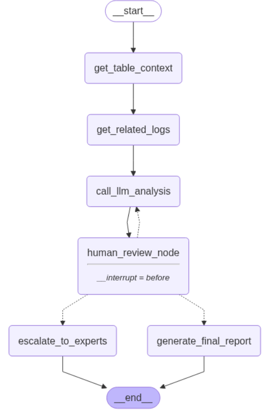

# 🤖 AI Incident Response Agent for Data Pipelines

> **AI Engineer World Fair Hackathon 2025** - Statement 2: Evaluation and Reliability  
> *Building agents that know when they're right, when they're wrong, and when they need help*

## 🎯 The Problem

Data pipeline failures cost companies **millions in downtime** and require **4+ hours of expert analysis** per incident. Current monitoring tools detect problems but can't:
- Analyze root causes intelligently
- Learn from past incidents  
- Know when they need human help
- Provide reliable long-running incident response

## 💡 Our Solution: Self-Evaluating Agent Framework

An AI agent that **evaluates its own work** and **gets smarter through human feedback**:

### ✨ Core Innovation: True Self-Evaluation
- 🎯 **Confidence Assessment**: Provides confidence scores (8/10, 9/10) and knows uncertainty
- 🔄 **Learning Loops**: Incorporates human corrections through modify workflows  
- 🧠 **Smart Escalation**: Automatically routes complex issues to appropriate experts
- 📊 **Evidence-Based**: Backs every conclusion with supporting evidence from logs

### 🔄 Three Evaluation Workflows

| Workflow | When Used | Outcome |
|----------|-----------|---------|
| **🟢 APPROVE** | Agent analysis is correct | Human approves → Auto-execute fixes |
| **🟡 MODIFY** | Agent misses something | Human corrects → Agent learns & re-analyzes |
| **🔴 ESCALATE** | Too complex for agent | Human escalates → Route to expert team |

## Tech Stack:
- LangGraph: State management + conditional routing
- Ollama + Llama 3.2: Local LLM inference
- MongoDB Atlas: Incident persistence + learning data (Sponsor ⭐)
- Python + Jupyter: Interactive development environment

## 🏗️ Technical Agent Flow


## Project Structure
```
├── agent.ipynb              # 🎬 Main demo notebook
├── requirements.txt         # 📦 Dependencies
├── README.md               # 📖 This file
├── .env.example            # 🔐 Environment template
├── data/                   # 📊 Mock incident data
│   ├── airflow_logs_*.json
│   ├── dqc_logs_*.json
│   └── table_metadata_*.json
├── helper/                 # 🛠️ Utility functions
│   ├── agent.py           # Agent orchestration
│   └── input.py           # Human input handling
│   ├── mongo.py           # Write data to MongoDB Atlas
├── example/               # 🎯 Demo scenarios
│   ├── demo.py           # Scenario definitions
│   └── sample_alert.py   # Alert examples
```

### Installation
```bash
# Clone repository
git clone [your-repo-url]
cd self-evaluating-agent

# Install minimal dependencies (< 1 minute)
pip install -r requirements.txt

# Setup Ollama
ollama pull llama3.2:latest

# Ready to demo!
jupyter notebook agent.ipynb
```

