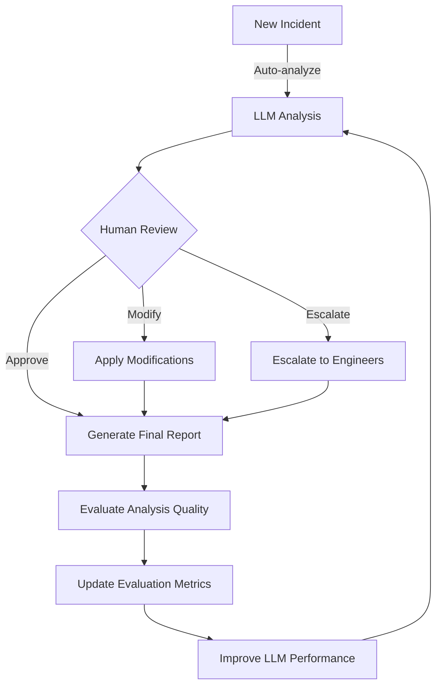

# Incident Analysis API with Self-Evaluation

This FastAPI application implements an incident analysis workflow for data pipeline incidents with LLM-assisted analysis, human-in-the-loop review, and self-evaluation capabilities. It addresses the AI Engineer Agents Hackathon 2025 topic of "Evaluation and Reliability."

## System Flow Diagram



## Features

- **Incident Analysis Workflow**: Structured pipeline for analyzing data incidents
- **LLM Integration**: AI-powered root cause analysis and recommendations using Ollama with qwen3:4b model
- **Human-in-the-Loop**: Review and feedback mechanism for LLM analysis
- **MongoDB Persistence**: Persistent storage of incidents, analyses, and evaluations
- **Self-Evaluation Framework**: Task-agnostic evaluation metrics for agent performance
- **Reliability Monitoring**: Tracking system reliability and performance over time
- **Automated Analysis**: Automatic incident analysis when new incidents are created

## Architecture

The application is built with a modular architecture:

- **API Layer**: FastAPI endpoints for incident management and evaluation
- **Service Layer**: Core business logic for incident analysis and evaluation
- **Data Layer**: MongoDB integration for persistent storage
- **Model Layer**: Pydantic models for structured data handling
- **LLM Layer**: Integration with Ollama for AI-powered analysis

## Addressing AI Engineer Agents Hackathon Goals

This application directly addresses the core goals of the AI Engineer Agents Hackathon:

### 1. AI Agents for Specialized Engineering Tasks

The application demonstrates an AI agent that specializes in data incident analysis:
- **Domain Expertise**: The LLM agent understands data pipeline components, logs, and error patterns
- **Structured Analysis**: Provides root cause analysis, timeline reconstruction, impact assessment, and recommendations
- **Engineering Focus**: Solves real-world data engineering problems with actionable insights

### 2. Human-in-the-Loop Collaboration

The system implements a collaborative workflow between AI and humans:
- **Review Mechanism**: Human experts can review, approve, modify, or escalate AI-generated analyses
- **Feedback Integration**: Human feedback is incorporated into final recommendations
- **Complementary Strengths**: AI handles initial analysis while humans provide expert judgment

### 3. Task-Agnostic Evaluation Framework

The evaluation framework works across different incident types and scenarios:
- **Quantitative Metrics**: Approval rates, modification rates, confidence scores, and reliability metrics
- **Qualitative Feedback**: Categorized improvement areas and detailed human feedback
- **Performance Tracking**: Monitors AI agent performance across various incident types

### 4. Self-Evaluation and Improvement

The system can assess its own performance and identify areas for improvement:
- **Gap Analysis**: Compares AI confidence with human-assessed quality
- **Pattern Recognition**: Identifies common failure patterns and improvement areas
- **Continuous Learning**: Framework designed to feed insights back into AI improvement

### 5. Reliability in Long-Running Tasks

The application ensures reliability in complex incident analysis workflows:
- **Completion Monitoring**: Tracks successful completion rates of analysis workflows
- **Performance Metrics**: Measures processing times and identifies bottlenecks
- **Error Handling**: Implements fallback mechanisms for API failures
- **Asynchronous Processing**: Uses background tasks for long-running analyses

## Prerequisites

- Python 3.9+
- Docker (for MongoDB container)
- Virtual environment (venv)
- Ollama (for local LLM inference)

## Installation

1. Clone the repository and navigate to the project directory

2. Start MongoDB using Docker:
   ```bash
   docker run -d -p 27017:27017 --name mongodb mongo:latest
   ```

3. Activate the virtual environment:
   ```bash
   source /path/to/venv/bin/activate
   ```

4. Install dependencies:
   ```bash
   pip install -r requirements.txt
   ```

5. Configure environment variables by creating a `.env` file:
   ```
   MONGODB_URL=mongodb://localhost:27017
   MONGODB_DB=incident_analysis
   OLLAMA_BASE_URL=http://localhost:11434
   OLLAMA_MODEL=qwen3:4b
   ```

## Sample Data

The application comes with sample data for testing and development purposes. The sample data includes:

1. **Table Metadata** (`table_metadata_20250601_045332.json`)
   - Contains metadata about database tables including ownership, dependencies, and SLA requirements
   - Used to provide context for incident analysis

2. **Airflow Logs** (`airflow_logs_20250601_045332.json`)
   - Contains execution logs from Airflow data pipelines
   - Includes timestamps, log levels, DAG IDs, task IDs, and error messages

3. **Data Quality Check (DQC) Logs** (`dqc_logs_20250601_045332.json`)
   - Contains logs from data quality check runs
   - Includes information about failed checks, expected vs. actual values

4. **Mock Incident Data** (`mock_incident_data_20250601_045332.json`)
   - Contains pre-defined incident scenarios
   - Each scenario includes an alert, context, and related logs

### Loading Sample Data

The application includes a data loader utility that populates the MongoDB database with sample data. You can load the data using the following steps:

1. Ensure MongoDB is running:
   ```bash
   docker ps | grep mongodb || docker run -d -p 27017:27017 --name mongodb mongo:latest
   ```

2. Run the data loader script:
   ```bash
   # Using the original data source
   python -m app.utils.data_loader /path/to/sample_data_source
   
   # Or using a local copy (if you've copied the data files to your project)
   python -m app.utils.data_loader /path/to/project/sample_data
   ```

3. The data loader will:
   - Load table metadata into the `table_metadata` collection
   - Load Airflow and DQC logs into the `logs` collection
   - Create sample incidents in the `incidents` collection

### Creating a Local Copy of Sample Data

If you want to keep a local copy of the sample data in your project:

```bash
# Create a directory for sample data
mkdir -p /path/to/project/sample_data

# Copy the sample data files
cp /path/to/sample_data_source/*.json /path/to/project/sample_data/
```

### MongoDB Debugging Queries

You can use the MongoDB shell to inspect and debug the database. Here are some useful commands:

1. **Connect to MongoDB Shell**:
   ```bash
   docker exec -it mongodb mongosh
   ```

2. **List All Databases**:
   ```javascript
   show dbs
   ```

3. **Select the Incident Analysis Database**:
   ```javascript
   use incident_analysis
   ```

4. **List All Collections**:
   ```javascript
   show collections
   ```

5. **Query Incidents Collection**:
   ```javascript
   // Find all incidents
   db.incidents.find()
   
   // Find a specific incident by ID
   db.incidents.findOne({_id: ObjectId("683c79a3e03b8641211d426d")})
   
   // Find incidents by status
   db.incidents.find({status: "analyzing"})
   
   // Find incidents with completed LLM analysis
   db.incidents.find({"llm_analysis": {$ne: null}})
   ```

6. **Query Table Metadata**:
   ```javascript
   // Find metadata for a specific table
   db.table_metadata.findOne({table_name: "customer_transactions"})
   ```

7. **Query Logs**:
   ```javascript
   // Find logs for a specific component
   db.logs.find({component: "data_quality_check"})
   
   // Find error logs
   db.logs.find({level: "ERROR"})
   ```

8. **Update an Incident Status**:
   ```javascript
   db.incidents.updateOne(
     {_id: ObjectId("683c79a3e03b8641211d426d")},
     {$set: {status: "new"}}
   )
   ```

9. **Count Documents in Collections**:
   ```javascript
   db.incidents.countDocuments()
   db.logs.countDocuments()
   db.table_metadata.countDocuments()
   ```

**Note**: Collections are created automatically when the first document is inserted. You do not need to explicitly create collections before inserting data. MongoDB will create them on-the-fly as needed.

## API Endpoints

### Incident Management

- `POST /incidents`: Create a new incident (with automatic analysis)
- `GET /incidents`: List all incidents
- `GET /incidents/{incident_id}`: Get incident details
- `POST /incidents/{incident_id}/analyze`: Start incident analysis
- `POST /incidents/{incident_id}/human-review`: Submit human review

### Evaluation Framework

- `POST /evaluation/incidents/{incident_id}`: Evaluate incident analysis
- `GET /evaluation/aggregate`: Get aggregate evaluation metrics
- `GET /evaluation/reliability`: Get system reliability metrics

### Example: Creating a New Incident

```bash
curl -X POST http://localhost:8000/incidents/ -H "Content-Type: application/json" -d '{
  "alert": {
    "severity": "CRITICAL",
    "check_type": "data_quality_anomaly",
    "table": "customer_transactions",
    "time_period": "2025-06-01T23:30:00.000Z",
    "expected_value": "0.05",
    "actual_value": "0.25"
  },
  "table_context": {
    "table_name": "customer_transactions",
    "database": "analytics_db",
    "owner": "data_team",
    "description": "Daily customer transaction data",
    "upstream_dependencies": [
      {
        "source": "payment_gateway",
        "database": "raw_data",
        "update_frequency": "hourly",
        "critical": true
      }
    ],
    "downstream_consumers": ["executive_dashboard", "fraud_detection"],
    "sla_requirements": {
      "update_schedule": ["06:00", "12:00", "18:00", "00:00"],
      "max_delay_tolerance": "30 minutes",
      "data_freshness_requirement": "1 hour",
      "availability_target": "99.9%"
    }
  },
  "related_logs": [],
  "scenario_name": "data_quality_issue",
  "scenario_description": "Data quality check failed due to high error rate in transaction processing"
}'
```

Response:
```json
{"incident_id":"683c79a3e03b8641211d426d","message":"Incident created successfully and analysis started"}
```

## Evaluation Framework

The evaluation framework provides a comprehensive set of metrics to assess the performance of the AI agent:
- `GET /evaluation/reliability`: Get system reliability metrics

## Self-Evaluation Framework

The application implements a comprehensive task-agnostic evaluation framework that provides metrics on both the quality of LLM-generated analyses and the overall system reliability. This framework is crucial for continuous improvement of the AI agent's performance.

### Evaluation Metrics

1. **LLM Analysis Quality Metrics**
   - **Approval Rate**: Percentage of LLM analyses that human reviewers accept without modifications
     - Example: `{"approved_rate": 0.7}` indicates 70% of analyses were approved as-is
   - **Modification Rate**: Percentage of analyses that required human modifications
     - Example: `{"modified_rate": 0.25}` shows 25% needed corrections
   - **Escalation Rate**: Percentage of analyses that were escalated to senior engineers
     - Example: `{"escalated_rate": 0.05}` indicates 5% required escalation

2. **Improvement Area Identification**
   - **Common Improvement Areas**: Categorized list of aspects that frequently need improvement
     - Example: `{"common_improvement_areas": [{"area": "Root cause analysis", "count": 12}, {"area": "Impact assessment", "count": 8}]}`
   - Each improvement area is tracked with occurrence count to identify patterns

3. **Confidence vs. Accuracy Monitoring**
   - **Average Confidence Score**: The LLM's self-reported confidence in its analysis
     - Example: `{"avg_confidence_score": 0.85}` indicates high confidence
   - **Quality Score**: Human-assessed quality of the analysis (0-1)
     - Example: `{"avg_quality_score": 0.78}` shows good but not perfect quality
   - The gap between these scores helps identify overconfidence or underconfidence

4. **System Reliability Metrics**
   - **Completion Rate**: Percentage of analyses that complete successfully
     - Example: `{"completion_rate": 0.98}` shows high reliability
   - **Failure Rate**: Percentage of analyses that fail to complete
     - Example: `{"failure_rate": 0.02}` indicates low failure rate
   - **Processing Time Statistics**: Min, max, and average processing times
     - Example: `{"avg_processing_time_seconds": 45.2, "max_processing_time_seconds": 120.5}`
   - **Reliability Score**: Composite score based on completion rate and processing time
     - Example: `{"reliability_score": 0.95}` indicates high overall reliability

## How This App Achieves the Hackathon Goals

This application directly addresses the "AI Engineer Agents" hackathon topic by implementing:

### 1. AI Agents for Specialized Engineering Tasks

The app demonstrates how AI agents can assist data engineers by:
- Automatically analyzing data pipeline incidents
- Identifying root causes of failures using domain-specific knowledge
- Providing actionable recommendations for resolution
- Making informed escalation decisions

### 2. Human-in-the-Loop Collaboration

The system implements a collaborative workflow between AI and humans:
- AI performs initial analysis of incidents
- Human reviewers can approve, modify, or escalate the AI's analysis
- The system incorporates human feedback to generate final recommendations
- Human overrides are respected for critical decisions

### 3. Self-Evaluation Framework

The app includes a comprehensive evaluation system that:
- Tracks metrics on AI agent performance (approval rates, modification rates)
- Identifies common areas for improvement in AI analysis
- Calculates quality and confidence scores
- Monitors reliability metrics like completion rates and processing times

### 4. Reliability in Long-Running Tasks

The system ensures reliability through:
- Asynchronous processing with proper error handling
- Background task management for long-running analyses
- Automatic retry mechanisms
- Comprehensive monitoring of system performance

### 5. Domain-Specific Knowledge

The AI agent specializes in data incident analysis by:
- Understanding data pipeline components and dependencies
- Interpreting logs and error messages
- Analyzing table metadata and data quality issues
- Providing domain-specific recommendations

## Future Enhancements

- **Feedback Loop Implementation**: Use evaluation metrics to automatically refine LLM prompts and parameters
- **Advanced Error Recovery**: Implement circuit breakers and retry mechanisms for increased reliability
- **Web UI Development**: Create an interactive dashboard for incident management and evaluation
- **A/B Testing Framework**: Compare different LLM models and prompting strategies
- **Multi-Model Ensemble**: Combine analyses from multiple LLMs for improved accuracy
- **Automated Improvement Areas**: Generate specific suggestions for LLM improvement based on evaluation patterns
- **Historical Trend Analysis**: Track performance metrics over time to measure improvement
- **Explainability Features**: Provide more detailed reasoning for LLM conclusions
- **Customizable Evaluation Criteria**: Allow organizations to define their own evaluation metrics
- Add authentication and authorization for API endpoints
- Enhance the evaluation framework with more detailed metrics
- Implement a notification system for critical incidents
- Create a dashboard for monitoring system performance
